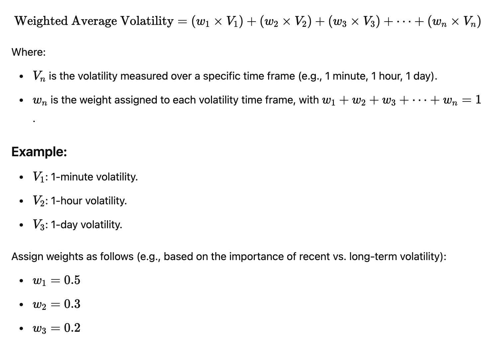

# 🦄 Adaptive Swap - Uniswap v4 Hookathon 🪝

> BY 
> This repository is based on [Uniswap v4 template](https://github.com/uniswapfoundation/v4-template/generate)

Adaptive Swap is a smart contract based on Uniswap v4 hooks that adjusts swap fees dynamically depending on the current market volatility. The goal is to protect liquidity provider from potential losses during rapid price movement and stabilise pools when markets are very volatile (reduce speculative behaviors from DeFi users that can lead to increased slippage for instance).

Volatility data is retrieved through external oracles. The hook will allow Liquidity Providers to pick which adjustment model they prefer (short, medium or long term volatility).

## Next step

- [] Implement Eigenlayer AVS basic PoC (with hardcoded volatility data into it, just to get barebone feature working)
- [] Write functionality in AVS to retrieve data from external APIs to get market volatility
- [] Connect AVS to Hook contract and implement basic functionality

I have other ideas of next steps, like different features available in the AVS based on a "tier level" that a user subscribed to for instance.

### Formula for weighted average volatility

The example from the docs of Uniswap V4 implement dynamic fee adjustments automatically at the time of the swap. 

Adaptive swap implementation not only implements dynamic fee adjustment before the swap (inside `_beforeSwap`), it also uses a volatility-based fee system using a **weighted average of volatility**. 

Instead of reacting to short-term price spikes (which can make swap fee rise considerably at on these short time periods), it calculates a weighted average of volatility over 3 different time frame (24 hours, 7 days and 30 days). This reduces drastic fee fluctuations and protects liquidity providers from short-lived volatility.

Below is the formula used to calculate the **weighted average of volatility based on time**. It assigns different weights to volatility measurements over various time frames: 



> **Note:** this method gives more emphasis to _short-term volatility_ but still considers longer-term trends to smooth out the volatility measure. 
> The weights could be adjusted according to how sensitive you want the fee system to be to different time frames. For instance one could put more weight on the 30 days time frame to make the fee more sensitive to the long term volatility (_e.g: 50 % instead of 20% in the current implementation_).


<!-- 
Items to write:
- [] Show the hooks I override: `beforeSwap`, etc...
- [] Explain the tests I wrote
 -->

1. The example hook [Counter.sol](src/Counter.sol) demonstrates the `beforeSwap()` and `afterSwap()` hooks
2. The test template [Counter.t.sol](test/Counter.t.sol) preconfigures the v4 pool manager, test tokens, and test liquidity.


---


## Set up

*requires [foundry](https://book.getfoundry.sh)*

```
forge install
forge test
```

<details>
<summary>Updating to v4-template:latest</summary>

This template is actively maintained -- you can update the v4 dependencies, scripts, and helpers: 
```bash
git remote add template https://github.com/uniswapfoundation/v4-template
git fetch template
git merge template/main <BRANCH> --allow-unrelated-histories
```

</details>

### Local Development (Anvil)

Other than writing unit tests (recommended!), you can only deploy & test hooks on [anvil](https://book.getfoundry.sh/anvil/)

```bash
# start anvil, a local EVM chain
anvil

# in a new terminal
forge script script/Anvil.s.sol \
    --rpc-url http://localhost:8545 \
    --private-key 0x... \
    --broadcast
```

See [script/](script/) for hook deployment, pool creation, liquidity provision, and swapping.

---

<details>
<summary><h2>Troubleshooting</h2></summary>


### *Permission Denied*

When installing dependencies with `forge install`, Github may throw a `Permission Denied` error

Typically caused by missing Github SSH keys, and can be resolved by following the steps [here](https://docs.github.com/en/github/authenticating-to-github/connecting-to-github-with-ssh) 

Or [adding the keys to your ssh-agent](https://docs.github.com/en/authentication/connecting-to-github-with-ssh/generating-a-new-ssh-key-and-adding-it-to-the-ssh-agent#adding-your-ssh-key-to-the-ssh-agent), if you have already uploaded SSH keys

### Hook deployment failures

Hook deployment failures are caused by incorrect flags or incorrect salt mining

1. Verify the flags are in agreement:
    * `getHookCalls()` returns the correct flags
    * `flags` provided to `HookMiner.find(...)`
2. Verify salt mining is correct:
    * In **forge test**: the *deployer* for: `new Hook{salt: salt}(...)` and `HookMiner.find(deployer, ...)` are the same. This will be `address(this)`. If using `vm.prank`, the deployer will be the pranking address
    * In **forge script**: the deployer must be the CREATE2 Proxy: `0x4e59b44847b379578588920cA78FbF26c0B4956C`
        * If anvil does not have the CREATE2 deployer, your foundry may be out of date. You can update it with `foundryup`

</details>

---

Additional resources:

[Uniswap v4 docs](https://docs.uniswap.org/contracts/v4/overview)

[v4-periphery](https://github.com/uniswap/v4-periphery) contains advanced hook implementations that serve as a great reference

[v4-core](https://github.com/uniswap/v4-core)

[v4-by-example](https://v4-by-example.org)

